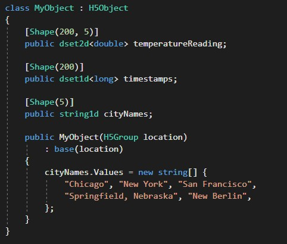

H5Ohm - the Object to Hierarchy Mapper
=========================

Turn concise `.NET` code like this...



...into a HDF5 file structure like this:


The [HDF group](https://portal.hdfgroup.org/display/knowledge/What+is+HDF5) 
publishes the specification for the hierarchical data format, a file format
well suited to store huge amounts of binary data in a structured way. 

`H5Ohm` attempts to tick all of the [boxes](https://github.com/HDFGroup/HDF.PInvoke/wiki/Must-Have's-for-High-Level-.NET-APIs)
that one wants from a `.NET` class library:

- [x] provide `numpy`-like arrays and `dtype`-like data type objects
- [x] throw Exceptions
- [x] handle `C` `string` as easy as `.NET` `string`
- [x] manage immutable identifiers under the hood
- [x] there's even basic `LINQ` support

Libraries for `C/C++` are officially maintained, but for `C#` there are no
official bindings that feel native to the language. This project builds on
the [HDF.PInvoke](https://github.com/HDFGroup/HDF.PInvoke) package, which 
simply wraps the native `C` routines under the hood. It is therefore just
as fast but much nicer to use than the native API:

```
using (H5File hf = H5File.Open(myfile, mode: "r"))
{
    dset2d<int> DSET = hf.Root["datasets/int2d"] as dset2d<int>;

    foreach (int[] row in DSET.Rows()) 
    {
        int i = row[0];
    }
}
```

`H5Ohm` builds with VisualStudio under Windows and also under Linux using
`msbuild` from the mono project.

hdf5 version considerations
-------------------------

The build is currently being unit-tested by travis against hdf5 v1.8.16,
the version shipped with Ubuntu 16.01 LTS (Xenial). 
However, hdf5 v1.10 and beyond is also supported. In order for this
to work, one must define `HDF5_VER1_10` in the VisualStudio build 
options. This takes care of the [API changes](https://github.com/HDFGroup/HDF.PInvoke/wiki/Important-Differences-between-HDF5-1.8-and-1.10)
introduced by the HDF group. It also allows for using the neat single-write 
multi-read feature by adding the `sw` and `mr` file modes to the `H5File` class.
